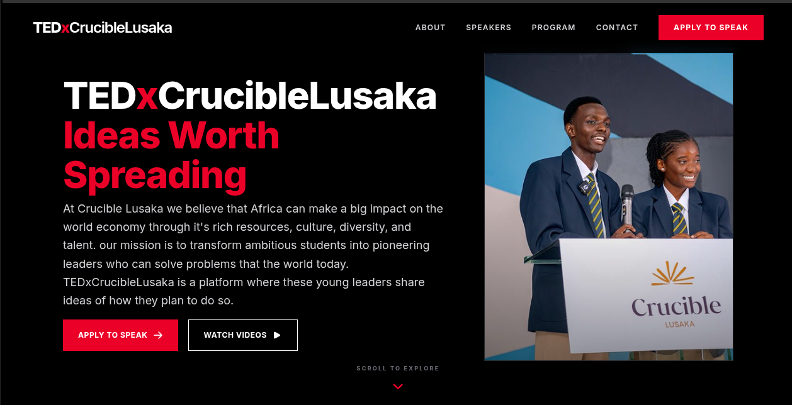

# TEDxCrucibleLusaka Website

  

<p align="center">
  Official website for <strong>TEDxCrucibleLusaka</strong>, built with React, Tailwind CSS, Framer Motion, and Web3Forms.
</p>

<p align="center">
  
  
  
  
</p>

## Live Demo

🌐 https://tedxcruciblelusaka.netlify.app/

---

# Table of Contents

- [About](#about)
- [Features](#features)
- [Tech Stack](#tech-stack)
- [Getting Started](#getting-started)
- [Project Structure](#project-structure)
- [Deployment](#deployment)
- [Contributing](#contributing)
- [Support](#support)
- [Maintainer](#maintainer)

---

# About

The **TEDxCrucibleLusaka Website** is the official landing page for the TEDx event hosted by Crucible International School in Lusaka, Zambia.

The website serves as the primary place for visitors to:

- Learn about the TEDx event
- Discover this year's theme
- Explore speakers
- View event information
- Contact the organizing team
- Register interest for future events

The project focuses on delivering a modern, responsive, and engaging experience while staying true to TEDx branding and storytelling.

---

# Features

- Responsive design for desktop, tablet, and mobile
- Smooth page animations using Framer Motion
- Modern UI built with Tailwind CSS
- Contact form powered by Web3Forms
- Fast performance with React + Vite
- Clean and reusable component architecture
- Easy deployment to Netlify

---

# Tech Stack

| Technology | Purpose |
|------------|---------|
| React | Frontend framework |
| Vite | Development & build tool |
| Tailwind CSS | Styling |
| Framer Motion | Page animations |
| Web3Forms | Contact form backend |
| Netlify | Hosting & deployment |

---

# Getting Started

## Prerequisites

- Node.js 18+
- npm

## Clone the repository

```bash
git clone https://github.com/joel-musonda/TEDxcrucibleLusaka-website.git

cd TEDxcrucibleLusaka-website
```

## Install dependencies

```bash
npm install
```

## Environment Variables

Create a `.env` file in the project root.

```env
VITE_WEB3FORMS_ACCESS_KEY=your_access_key_here
```

You can obtain a free access key from Web3Forms.

## Run the development server

```bash
npm run dev
```

Visit

```
http://localhost:5173
```

---

# Build for Production

```bash
npm run build
```

Preview the production build locally:

```bash
npm run preview
```

---

# Project Structure

```
src/
│
├── assets/
├── components/
├── pages/
├── App.jsx
├── main.jsx
│
public/
│
package.json
tailwind.config.js
vite.config.js
```

*(The exact structure may vary slightly as the project evolves.)*

---

# Deployment

The project is deployed using **Netlify**.

To deploy your own version:

```bash
npm run build
```

Upload the generated `dist` folder to Netlify or connect the repository for automatic deployments.

---

# Contributing

Contributions are welcome.

If you'd like to improve the project:

1. Fork the repository
2. Create a new branch

```bash
git checkout -b feature/amazing-feature
```

3. Commit your changes

```bash
git commit -m "Add amazing feature"
```

4. Push the branch

```bash
git push origin feature/amazing-feature
```

5. Open a Pull Request

---

# Support

If you encounter any issues or have suggestions, please open an issue in this repository.

For TEDx event enquiries, use the contact form available on the website.

---

# Future Improvements

- Speaker management through a CMS
- Event countdown timer
- Gallery section
- Blog/news updates
- Dark mode
- Internationalization
- Improved accessibility
- SEO enhancements

---

# Maintainer

**Joel Musonda**

Student Developer • AI Builder • Founder of Ping

GitHub:
https://github.com/joel-musonda

---

## Acknowledgements

- TEDx
- React
- Tailwind CSS
- Framer Motion
- Web3Forms
- Netlify

---

If you found this project helpful, consider giving it a ⭐ on GitHub!